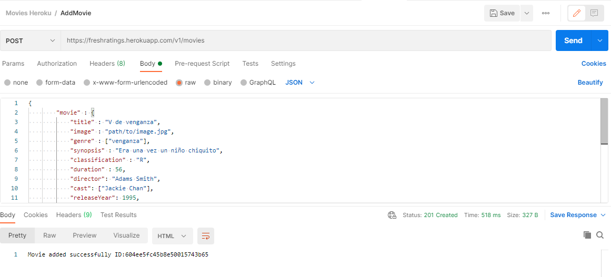
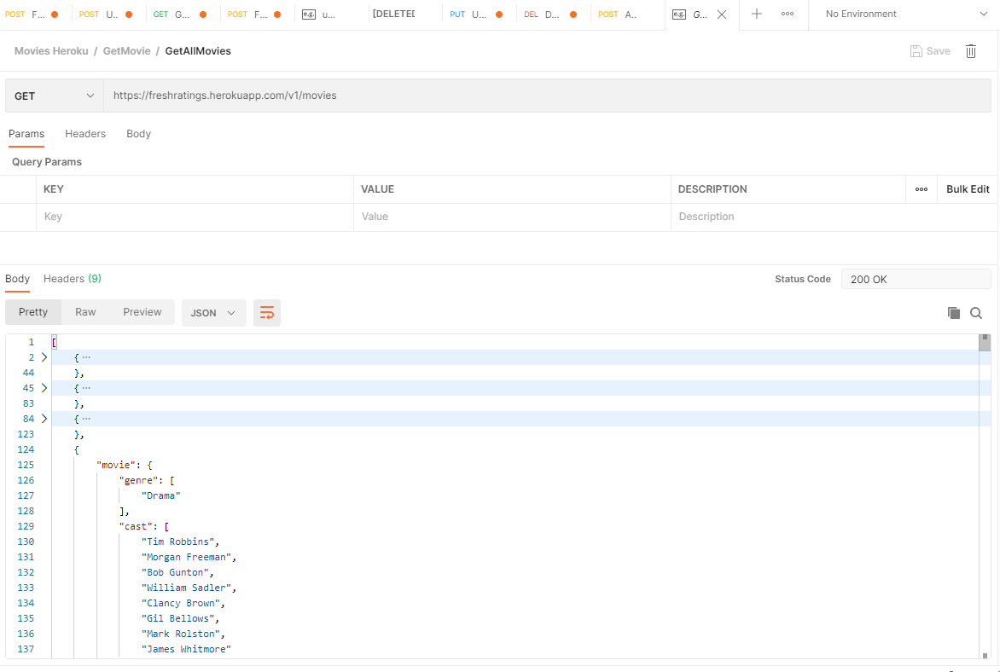
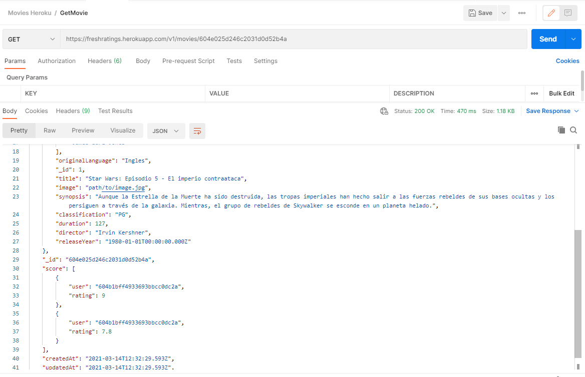
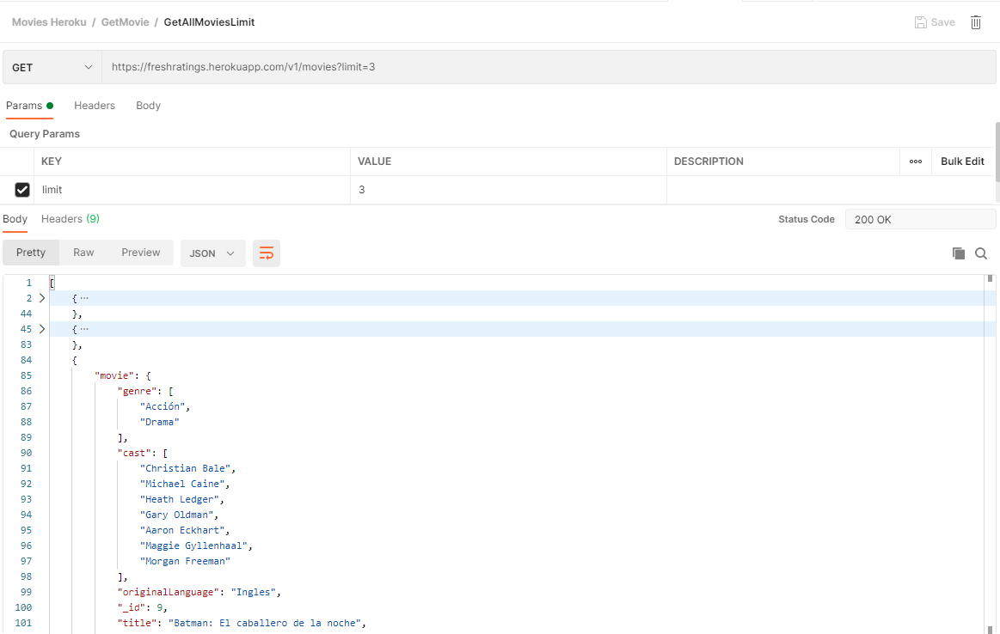
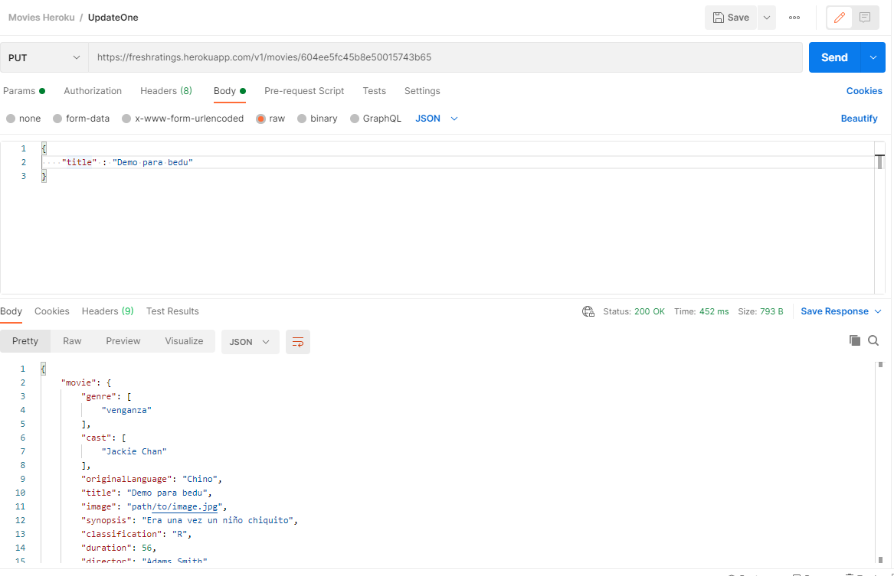
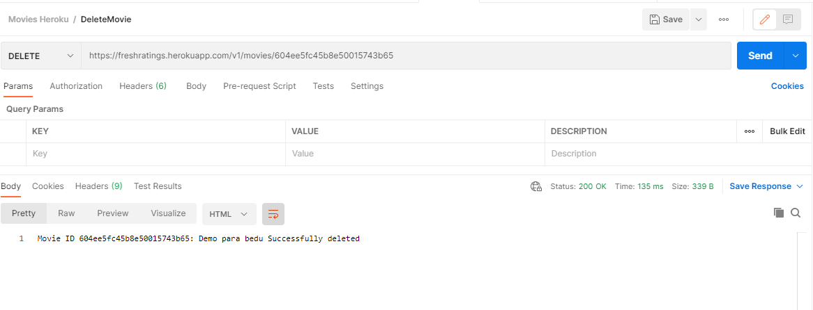

# <center>🎥 Proyecto Fresh Ratings 🎥</center>
Desarrollo de API con base en lo aprendido a lo largo de las sesiones correspondientes al módulo "Back-end Fundamentals", de la fase 2 del programa Desarrollo Web, impartido por la empresa BEDU en colaboración con Becas Santander.  
#### Equipo 18
- Jesus Omar Cervantes Gonzalez
- Sergio Alberto García Martínez
- Carlos Iván Ramírez Rendón

Puedes encontrar la documentacion Swagger en este link:
[https://app.swaggerhub.com/apis-docs/FreshRatings/FreshRatingsAPI/1.0.0](https://app.swaggerhub.com/apis-docs/FreshRatings/FreshRatingsAPI/1.0.0)

App en Heroku:
[https://freshratings.herokuapp.com/v1](https://freshratings.herokuapp.com/v1)

## 📜 Descripción del proyecto
El proyecto consiste en desarrollar una API para la manipulación y búsqueda de películas, así como su información. Los usuarios serán capaces de manipular la información almacenada en la base de datos y realizar operaciones `CRUD` (Create, Read, Update, Delete), correspondientes a las peticiones `GET`, `POST`, `PUT` y `DELETE`.

### 🎯 Requisitos:
Los requisitos mínimos que debe contar la API son los siguientes:
- Servicio para crear un registro
- Servicio para eliminar un registro
- Servicio para modificar un registro en específico
- Servicio para modificar más de un registro
- Servicio para consultar un registro por id
- Servicio para consultar todos los registros existentes
- Servicio para consultar por coincidencia de atributos
- Servicio para consultar todos los registros existentes (limitados a cierta cantidad)
- Servicio para consulta por campos específicos

### 👨‍💻 Herramientas utilizadas:
Para la elaboración de esta API se necesitaron varias herramientas, dependencias, librerías, etc., algunas de las más importantes son las siguientes:
- #### JavaScript / NodeJS
    `Node.js` es un entorno `JavaScript` que permite ejecutar en el servidor, de manera asíncrona, con una arquitectura orientada a eventos.  
    `JSON` es un formato basado en texto estándar para representar datos estructurados en la sintaxis de objetos de JavaScript.
- #### npm
    `npm` es el sistema de gestión de paquetes por defecto para Node.js que facilita la instalación y administración de paquetes. En este proyecto (entre otros), se utilizaron los siguientes:
    - `expresss`: Es un framework web que proporciona mecanismos para la escritura de manejadores de peticiones con diferentes verbos HTTP en diferentes caminos URL (rutas).
    - `nodemon`: Herramienta útil ya quevmonitorea los cambios en el código y automáticamente reinicia el servidor.
    - `cors`: Es un paquete que proporciona un middleware *Connect / Express* que se puede usar para habilitar CORS con varias opciones.
    - `body-parser`: Es un middleware de análisis que es responsable de analizar los cuerpos de las solicitudes entrantes en un middleware antes de manejarlo.
- #### MongoDB
    Para este proyecto se utilizó MongoDB, una base de datos de documentos que ofrece gran escalabilidad y flexibilidad, así como un modelo de consultas e indexación avanzado.  
    `Mongoose`
    Es una biblioteca de **ODM** para MongoDB y Node.js. Ayuda a manejar las relaciones entre los datos, cuenta con un esquema de validaciones y se usa para la traducción entre objetos en código y su representación en MongoDB.

### 📋 Historias de usuario
Las historias de usuario son descripciones cortas y simples de una característica contada desde la perspectiva de la persona que desea la nueva capacidad, generalmente un usuario o cliente del sistema.  
Para este proyecto desarrollamos las historias de usuario siguientes:  
  

### 🎬 Modelo
Para el desarrollo de la API planteamos dos modelos diferentes, mismos que se plasmaron una estructura JSON que contiene información acerca de las propiedades del documento, llamada **Schema**.  
- **Movie.js**
    Consiste en la entidad sobre la que se basa el funcionamiento de la API, en él se definen los atributos y las restricciones de cada campo, tal como se muestra a continuación:
    ```
    const Movie = new Schema({

    movie :{
        _id : {
            type: Number,
            index: true ,
            unique: true
        },
        title: {
            type: String,
             unique: true,
              required: [true,'Title cannot be empty'],
              index: true
        },
        image:{ type:String },
        genre: {
            type: [{type:String, required:true}],
            validate:{
            validator: v => { return v.length !== 0},
            msg: props => 'Must have at least one genre'
        }},
        synopsis: {
            type:String,
             required:[true,'Must have a synopsis']
            },
        classification: {
            type: String, required:[true,'Classification cannot be empty'],
             enum:[ 'G','PG','PG-13','NC-17', 'NR','R'],
             uppercase: true,
             match: [/[a-zA-Z]+\-*[0-9]*/si]
            },
        duration:{type:Number, required: [true,"Duration cannot be empty"]},
        director:{ type:String, required:[true, "A movie must have a director" ]},
        cast: {
            type:  [ {type: String} ],
            validate:{
                validator: v => {
                    return v.length !==0
                },
                msg: v => "Must have at least one actor"
            }
        }
       ,
        originalLanguage: {type: String , default: 'Inglés'},
        releaseYear: {type: Date, required: [true, 'Must have a release year']}
    },
    score: {
        type: [{
            user: {
                type: Schema.ObjectId,
                ref : 'User'
            },
            rating: {
                type: Number,
                required: true,
                min : 0,
                max : 10
            },
            _id: false
        }]
    }
    },{timestamps:true});
    ```
- **User.js**
    Representa la entidad del usuario que va a realizar las consultas y que, a su vez puede registrarse se utilizó el schema siguiente:
    ```
    const User = new Schema({

    username: {
        type : String,
        unique: true,
        required: [true, "User cannot be empty"],
        match: [/^(?=.{4,20}$)(?![_.])(?!.*[_.]{2})[a-zA-Z0-9._]+(?<![_.])$/si, 'Invalid User'],
        index: true,
        minlength : 4,
        maxlength: 20
    },
    name: { type : String, required : true},
    lastName : {type: String, required : true},
    age: {type: Number, min:1, max:100, required:true},
    email : {
        type: String,
        unique : true,
        required: [true, "Email cannot be empty"],
        match : [/^[-\w.%+]{1,64}@(?:[A-Z0-9-]{1,63}\.){1,125}[A-Z]{2,63}$/si,'Invalid email'],
        index: true
    },
    password :{ type:String, required: true },
    type:{
        type: String,
        lowercase: true,
        enum: ['admin','user'],
        default: 'user'
    }
    },{timestamps:true});
    ```
## 😎 Implementación
Una vez realizado todo el análisis de las historias de usuario y la implementación mediante el código, se obtuvieron los resultados siguietes:

#### 1. Agregar una nueva película
Para realizar esta acción se necesita la petición `post` y la URL como la que se muestra a continuación:
> `https://freshratings.herokuapp.com/v1/movies`  

Puesto que corresponde a una petición post, se necesita mandar un objeto JSON en el cuerpo, mismo que será almacenado en la BD, como el siguiente:
```
{
    "title": "Spider-Man",
    "image": "https://i2.wp.com/plexmx.info/wp-content/uploads/2019/08/spiderman_ver1_xxlg.jpg?fit=1973%2C2935&ssl=1",
    "genre": ["Fantasy", "Action"],
    "synopsis": "A great movie",
    "classification": "PG-13",
    "duration": 116,
    "director": "Sam Raimi",
    "cast": ["Tobey Maguire", "Willem Dafoe", "Kirsten Dunst", "James Franco"],
    "originalLanguage": "Inglés",
    "releaseYear": 2002-01-01
}
```

#### 2. Eliminar una película
Para realizar esta acción se necesita la petición `delete` y la URL como la que se muestra a continuación:
> `https://freshratings.herokuapp.com/v1/movies/:id`  

La acción que se quiere realizar corresponde a la eliminación de una sola película, por lo tanto se debe señalar el id (identificador único de cada película) dentro del URL de la petición, correspondiente al parámetro **":id"**, y no se debe añadir algo extra en el cuerpo de la petición.

#### 3. Actualizar un solo atributo de una nueva película
Esta acción necesita la petición `put` y la URL como la que se muestra a continuación:
> `https://freshratings.herokuapp.com/v1/movies/:id`  

Puesto que corresponde a una petición put, se necesita mandar un objeto JSON con el atributo que se quiere modificar, tal como en el ejemplo siguiente:
```
{
    "originalLanguage": "Chino"
}
```
#### 4. Actualizar todos los atributo de una nueva película
Esta acción (al igual que la anterior), necesita de un **id** para encontrar la película que se quiere actualizar, además se necesita un JSON con todos los atributos pertenecientes a la película, muy parecido al de agregar película.  

#### 5. Consultar una nueva película por id
Para realizar esta acción se necesita la petición `get` y la URL como la que se muestra a continuación:
> `https://freshratings.herokuapp.com/v1/movies/:id`  

La acción que se quiere realizar corresponde a la obtención de una sola película, por lo tanto se debe señalar el id (identificador único de cada película) dentro del URL de la petición, correspondiente al parámetro **":id"**, y no se debe añadir algo extra en el cuerpo de la petición.

#### 6. Consultar todas las películas
Para realizar esta acción se necesita la petición `get` y la URL como la que se muestra a continuación:
> `https://freshratings.herokuapp.com/v1/movies`  

Puesto que se desea obtener todos los registros correspondientes a las películas, no se necesita añadir algo extra al cuerpo de la petición.  

#### 7. Consultar "n" cantidad de películas
Para esta acción se pasará como parámetro en el URL el número de películas que se quieren obtener, no se necesita pasar un JSON en el cuerpo de la petición.  

#### 8. Consultar películas por coincidencia de atributos
En esta petición se obtendrán todos los registros de películas que dentro se sus registros tengan presente el texto que el usuario deseé, es decir, si el usuario busca la palabra "Spider", la respuesta serán las películas de "Spider-man", "Spider-man 2" y "Spider-man 3".  

#### 9. Consultar película limitando los campos mostrados
Para realizar esta acción se necesita la petición `post` y la URL como la que se muestra a continuación:
> `https://freshratings.herokuapp.com/v1/movies/search?:id`  
Ejemplo: `https://freshratings.herokuapp.com/v1/movies/search?_id=20`  

La acción que se quiere realizar corresponde a la obtención de una sola película, pero limitando los campos, por lo tanto se debe señalar el id (identificador único de cada película) dentro del URL de la petición, correspondiente al parámetro **":id"**.  
Además, se necesita mandar un JSON con los atributos que desean mostrarse, teniendo **1** para mostrarlo o **0** en caso de no quererlo. Como el siguiente ejemplo:
```
{
    "_id: 0,
    "id": 1,
    "title": 1,
    "image": 0,
    "genre": 0,
    "synopsis": 0,
    "classification": 0,
    "duration": 0,
    "director": 0,
    "cast": 0,
    "originalLanguage": 0,
    "meleaseYear": 0
}
```
## 🎞 Resultados
A continuación se muestran algunas capturas de las consultas realizadas  
  
  
  
  
  
  
  


